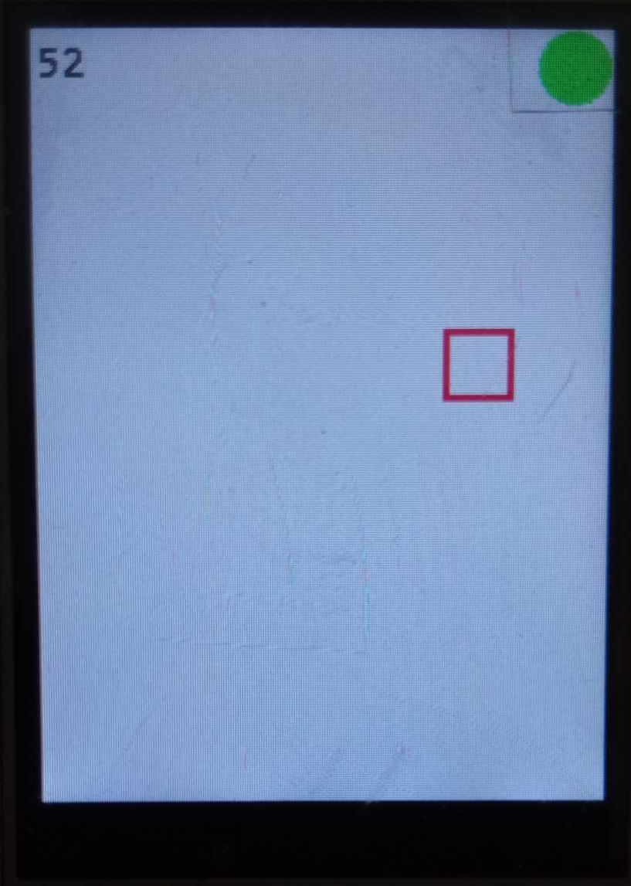
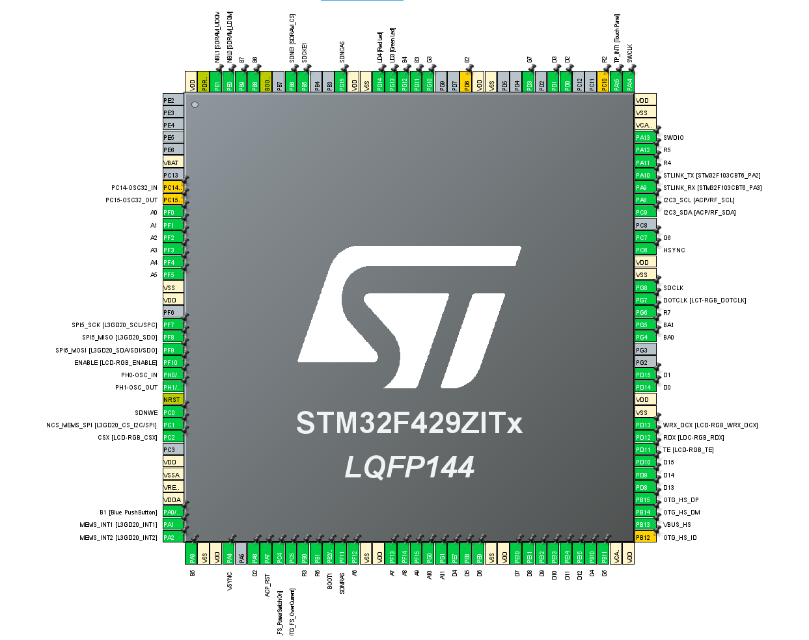
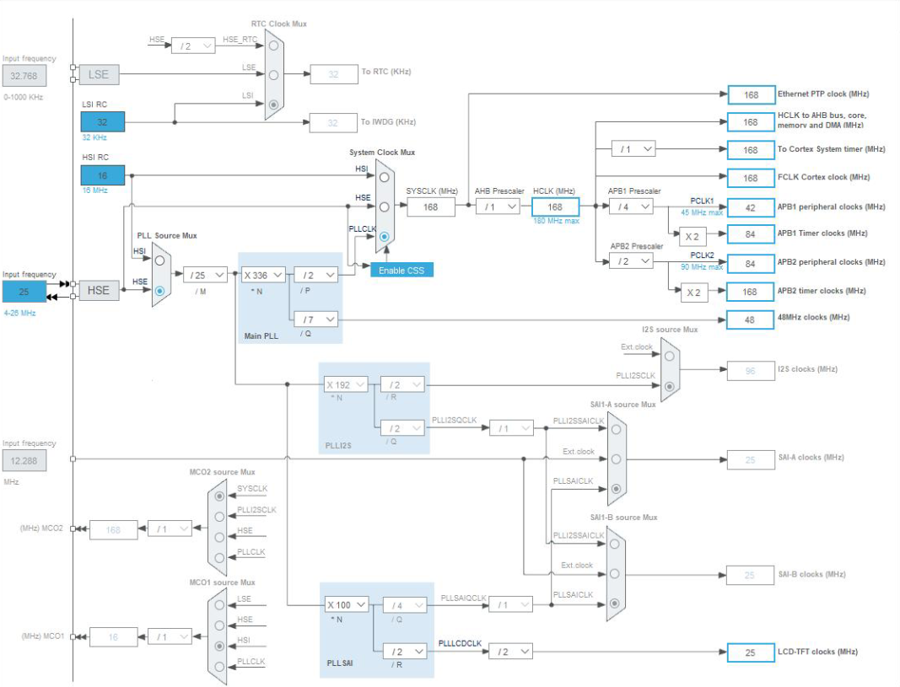

# BoxBall

BoxBall is a project utilizing LCD screen on STM32F429I-DISC1 and an IMU. The goal was to write a game where the user can steer the ball with with the turn of the board on both axis. The ball would have implemented basic physics to reflect of the "wall" of the screen as well as accelerate based on the angle of the twist. The project utilizes MPU6050 for usage of accelerometer and gyroscope with complementary filer. To add some entertainment there is a sqaure field that the user can steer the ball into and gain some points.

## Key Features

- **Control:** Steer the ball based on the turn of the board utlizing IMU.
- **IMU** Usage of gyroscope and accelerometer through complementary filter.
- **Entertainment:** Possibility to earn points by steering the ball into sqaure field.
 

## Microcontroller configuration

## Clock configuration

